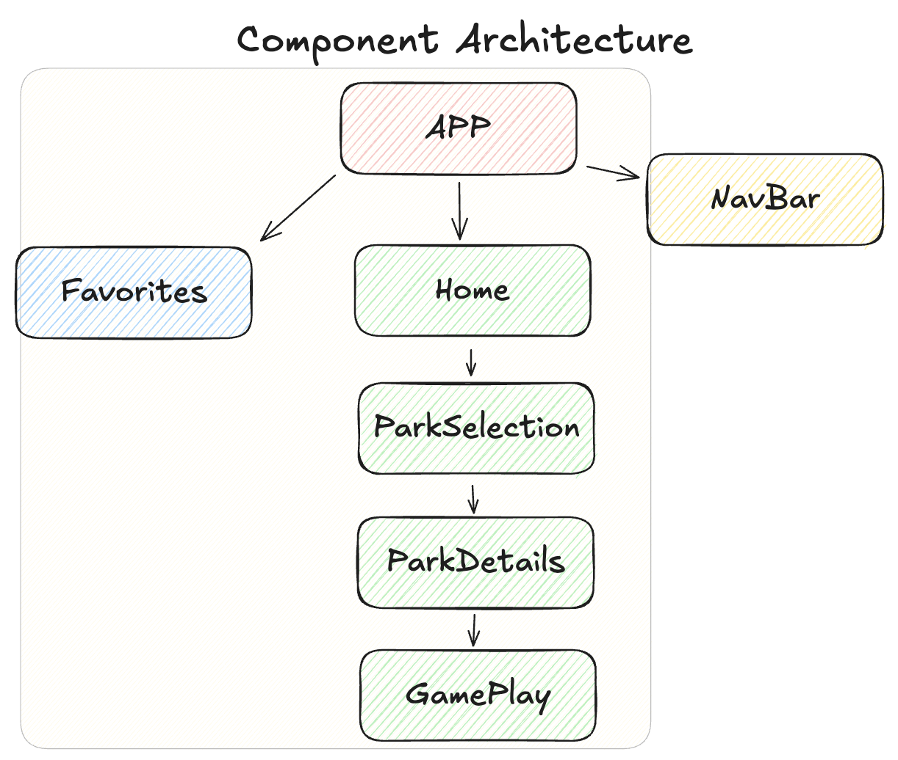
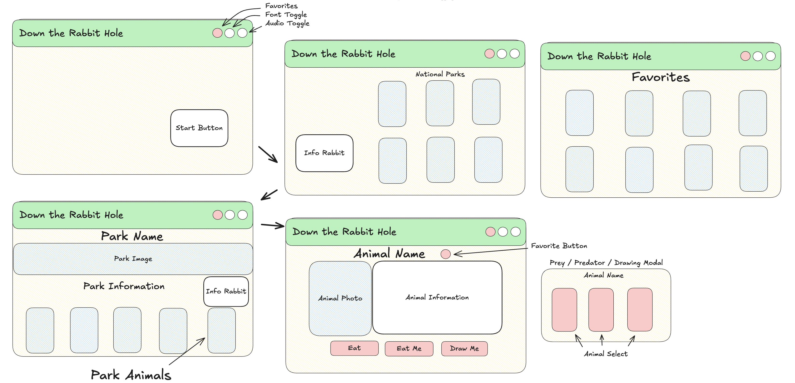

<h1> Down the Rabbit Hole </h1>

[Down the Rabbit Hole Deployed Link](https://down-the-rabbit-hole.netlify.app/)

[GitHub Project Board](https://github.com/orgs/Down-the-Rabbit-Holes/projects/2)

[Figma Planning Project Board](https://www.figma.com/board/ynLaURjRxnlzNZjrNNcEDD/Down-the-Rabbit-Hole?node-id=0-1&t=okU4GmhfPWX158Hi-1)

Down the Rabbit Hole is an engaging and educational web application primarily designed for elementary students but enjoyable for all ages. The platform immerses users in the fascinating world of animals and their ecosystems, allowing them to search through various national parks to discover unique creatures and learn about their habitats and behaviors. Users can explore an animal’s role in the food chain by viewing its predators and prey, with the ability to click through and learn about each connection. A creative “How to Draw the Animal” feature adds a hands-on element, making learning fun and interactive. Additionally, users can save their favorite animals for later research with the convenient favorites button. Whether for young learners, nature enthusiasts, or aspiring artists, Down the Rabbit Hole offers an enriching and accessible experience.

<h2> Context </h2>

Down the Rabbit Hole was developed as a consultancy project, inspired by one team member’s vision and brought to life by a collaborative team of five. Over an initial two-week sprint, we transformed the idea into a fully functional web application.

Following the successful completion of Phase 1, we embarked on a Phase 2, two-week sprint to implement extensive updates in preparation for a demo competition. These updates included the ability to select a national park to learn more about it and discover which animals inhabit it, a predator-and-prey navigation system, and a “How to Draw the Animal” section.

Each team member participated in all phases of the project, from ideation to development and presentation. Regular meetings facilitated discussions on progress and challenges, ensuring that everyone had a comprehensive understanding of the codebase and project architecture. This collaborative effort resulted in an engaging, dynamic educational platform that explores animal ecosystems and highlights the power of teamwork.

<!-- <h2> Tech Stack </h2>

BE - Ruby on Rails, tested with RSpec, simplecov, webmock & vcr

FE - Built with React and tested with Cypress -->

## Tech Stack

### Backend
-  

  - Tested with:
    -   
    - SimpleCov  
    -  VCR  
    -  WebMock  

### Frontend
- 

  - Tested with:
    - 

<h2> Installation </h2>

1. Fork and clone this BE repo 
[Down The Rabbit Hole BE repo](https://github.com/Down-the-Rabbit-Holes/down_the_rabbit_hole_BE)
2. `cd` into the repo
2. Run these commands in your terminal
  - `bundle install`
  -  `rails db:{drop, create, migrate, seed}`
  -  `rails s`

4. Fork this FE repo
[Down the Rabbit Hole FE repo](https://github.com/Down-the-Rabbit-Holes/down_the_rabbit_hole_FE)
5. `cd` into cloned repo
6. Run `npm install`
7. Run `npm start`
8.  Enter `control + c` in your terminal to stop running the React app at any time
9. To run Cypress tests, use `npx cypress open`

<h2> Usage </h2>

### Overview

### Accessibility

### Animal Details

### Responsive Design

<h2> Contributors </h2>

Candice Cirbo - [linkedin](https://www.linkedin.com/in/candicecirbo/) - [gitHub](https://github.com/CCirbo) - ccirbots@gmail.com

Jim Macur - [linkedin](https://www.linkedin.com/in/jimmacur/) - [gitHub](https://github.com/jimmacur) - jim.macur@gmail.com 

Marshall Hotaling - [linkedin](https://www.linkedin.com/in/marshall-hotaling-7b52a8304/) - [gitHub](https://github.com/marshallhotaling) - marshall.hotaling@gmail.com

Renee Messersmith - [linkedin](https://www.linkedin.com/in/reneemessersmith/) - [gitHub](https://github.com/reneemes) - rmessersmith25@gmail.com

Stefan Bloom - [linkedin](https://www.linkedin.com/in/stefanjbloom/) - [gitHub](https://github.com/stefanjbloom) - stefanjbloom88@gmail.com

<<<<<<<<<>>>>>>>>

Special thanks to [Lito Croy](https://www.linkedin.com/in/litocroy/) for his word-smithing of the catchphrase "Eat Me" for our predator button

<h2> Learning Goals </h2>

- **Project Ideation and Execution**: Develop a web application from a student-led idea, focusing on solving real-world problems.

- **Team Dynamics and Collaboration**: Enhance understanding of team dynamics by participating in all phases of project development, from ideation to presentation.

- **Service-Oriented Architecture (SOA)**: Gain practical experience with SOA by implementing at least one Rails backend service and a React frontend application.

- **Professional Development**: Prepare for workplace environments by working on a larger team and understanding the impact of changes within a complex system.

- **Technical Skills**:
  - Implement and deploy both backend (Rails API) and frontend (ReactJS) applications.
  - Utilize at least one external API.
  - Ensure thorough testing, including unit and integration tests.
  - Adhere to MVC architecture and refactor API consumption out of controllers.

- **User Empathy and Design**: Develop user personas to understand target users better and conduct an equity analysis to prioritize inclusion.

- **Frontend Development**:
  - Build a multi-page application with React Router.
  - Implement client-side validations and error-handling.
  - Conduct robust Cypress testing.
  - Ensure responsive design across different screen sizes.

- **Deployment**: Deploy both frontend and backend applications using platforms like Vercel or Netlify for the frontend.
